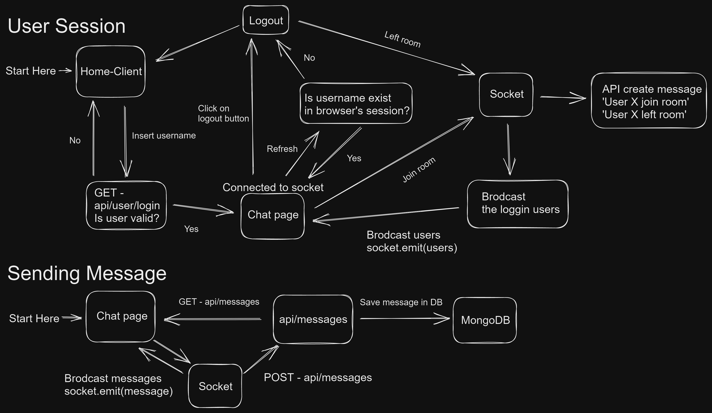

# Chat App:

## About My Project:

Chat App Assignment is developed as a home assignment for a Full-Stack position at Yad2. \
This real-time chat application allows users to chat with each other in real time, view the global chat's messages, and see the user currently logged in. \
With its user-friendly interface and responsive design, this chat app provides users with a seamless and enjoyable experience.

<video src="https://user-images.githubusercontent.com/87934536/229322850-b4c10500-1116-4746-a06b-74b239586137.mp4" controls="controls" style="max-width: 730px;">
</video>

# Table of contents

- [**App's Architecture**](#apps-architecture)
- [**Main Flows**](#main-flows)
- [**Main Features**](#main-features)
- [**Technologies**](#technologies)
- [**Packages**](#packages)
- [**Installation**](#installation)
- [**What's next?**](#whats-next)
- [**Images**](#images)

## App's Architecture:

   

## Main Flows:

   

## Main Features:

1.  **Live Chat** - The Chat App allows users to engage in a real-time chat conversation with their friends who are currently logged in to the app.

2.  **Users currently logged In List** - The app displays a list of all the users currently logged in to the app. \
    Users can see who has joined the chat and who has left.

3.  **History Of Messages** - Users can view the history of chat messages sent in the chat room and the time each message was sent. \
    If two or more messages were sent on different days, the app would automatically insert a divider with the date each message was sent.

4.  **Typing Indicator** - Users can see who is typing a message in the chat room. \
    This feature helps let users know that someone is about to send a message and to wait for it.

## Technologies:

- **[React](https://reactjs.org/)** - A JavaScript library for building user interfaces.
- **[TypeScript](https://www.typescriptlang.org/)** - For type checking and improved developer productivity.
- **[Node.js](https://nodejs.org/en/)** - For efficient and scalable development of the application's backend logic.
- **[MongoDB](https://www.mongodb.com/)** - A NoSQL database that stores users' account data.
- **[Docker](https://www.docker.com/)** - Containerize the app to be easy and provide a consistent and reproducible environment for running and deploying applications.

## Packages:

- **Front-end** :

  - [Tailwind CSS](https://tailwindcss.com/) - A utility-first CSS framework for styling the application's user interface.
  - [Socket.IO Client](https://socket.io/) - A client-side library for Socket.IO enables real-time bidirectional event-based communication.
  - [Axios](https://axios-http.com/docs/intro) - For making API requests to the backend.
  - [React Router](https://www.npmjs.com/package/react-router-dom) - For routes management.
    application's user interface.
  - [use-debounce](https://www.npmjs.com/package/use-debounce) - To improve the search and filter process by debouncing user inputs.
  - [React Icons](https://www.npmjs.com/package/react-icons) - For icons

- **Back-end**:

  - [Express](https://www.npmjs.com/package/express)- For building the server.
  - [Dotenv](https://www.npmjs.com/package/dotenv) - For environment variables.
  - [Socket.IO](https://socket.io/) - A server library for Socket.IO, which enables real-time bidirectional event-based communication.

- **Misc**:
  - [Prettier](https://prettier.io/) - Ensuring code style and formatting consistency across the project.
  - [Husky](https://www.npmjs.com/package/husky) - For git hooks manager that runs scripts before git commands.
  - [Lint-staged](https://www.npmjs.com/package/lint-staged) - For running linters against staged git files, used for maintaining code quality.

## Installation

## Running Docker:

1. **Clone the repo**

   ```
   git clone https://github.com/rom-orlovich/chat-app.git
   ```

2. **Install all the dependencies**

```
npm run init-p
```

3. **Create .env files in the root of the client and server folders.**

4. **Run command**

   ```
   docker compose up -d
   ```

5. **Go to http://localhost:3000 and have fun**!

## What's Next:

- Add a user authentication system to the application to ensure that only authorized users can access the chat
- Support chat rooms system so that users can create private chat rooms and invite other users to join
- Implement a private room feature that allows users to have private conversations with one another
- Add a filter messages and user data system to the application to allow users to search for specific messages or users.

## Images:

### Home

   

### Messages

   
   
### Login Users
   
   
