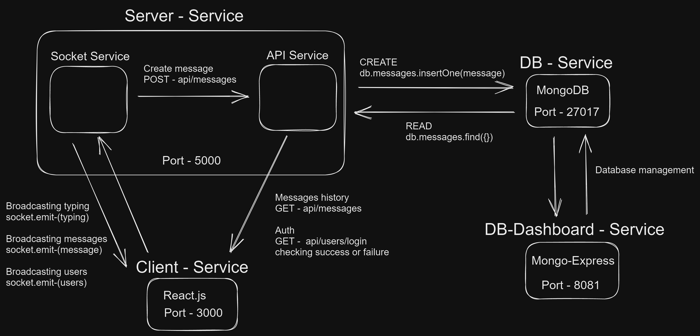

# Chat App:

## About My Project:

Chat App Assignment is developed as a home assignment for fullstack position at Yad2.
This is a real-time chat application that allows users to chat with each other in real-time, view the global chat's messages and see the user that currently login.

<video width="700" height="700" controls>
  <source src="./readme-media/chat_app.mp4" type="video/mp4">
</video>

# Table of contents

- [**Architecture**](#architecture)
- [**Main Flows**](#main_flowss)
- [**Main Features**](#main_features)
- [**Technologies**](#technologies)
- [**Packages**](#packages)
- [**Installation**](#installation)
- [**What's next?**](#whats-next)
- [**Images**](#images)

## App's Architecture:

   

## Main Flows:

   

## Main Features:

- **Live chat** - The Chat App allows users to engage in a real-time chat conversation with their friends who are currently logged in to the app.

- **Users currently logged in** - The app displays a list of all the users who are currently logged in to the app. Users can see who has joined the chat and who has left.

- **History of messages** - Users can view the history of chat messages that were sent in the chat room and the time each message was sent.
  If there are two or more messages that were sent on different days, the app will automatically insert a divider with the date on which each message was sent.

- **Typing indicator** - Users can see who is currently typing a message in the chat room. This feature is helpful in letting users know that someone is about to send a message and to wait for it.

## Technologies:

- **[React](https://reactjs.org/)**
- **[TypeScript](https://www.typescriptlang.org/)**
- **[Node.js](https://nodejs.org/en/)**
- **[MongoDB](https://www.mongodb.com/)** - A NoSQL database that stores users' account data.
- **[Docker](https://www.docker.com/)**

## Packages:

- **Front-end** :

  - [Tailwind CSS](https://tailwindcss.com/) - A utility-first CSS framework used for styling the application's user interface.
  - [Socket.IO Client](https://socket.io/) - A client-side library for Socket.IO, which enables real-time bidirectional event-based communication.
  - [Axios](https://axios-http.com/docs/intro) - For making API requests to the backend.
  - [React Router](https://www.npmjs.com/package/react-router-dom) - For routes management.
    application's user interface.
  - [use-debounce](https://www.npmjs.com/package/use-debounce) - To improve the search and filter process by debouncing user inputs.
  - [React Icons](https://www.npmjs.com/package/react-icons) - For icons

- **Back-end**:

  - [Express](https://www.npmjs.com/package/express)- For building the server.
  - [Dotenv](https://www.npmjs.com/package/dotenv) - For environment variables.
  - [Socket.IO](https://socket.io/) - A server library for Socket.IO, which enables real-time bidirectional event-based communication.

- **Misc**:
  - [Prettier](https://prettier.io/) - Ensuring code style and formatting consistency across the project.
  - [Husky](https://www.npmjs.com/package/husky) - For git hooks manager that runs scripts before git commands.
  - [Lint-staged](https://www.npmjs.com/package/lint-staged) - For running linters against staged git files, used for maintaining code quality.

## Installation

## Running Docker:

1. **Clone the repo**
   ```
   git clone git@github.com:rom-orlovich/jobs-agent-backend.git
   ```
2. **Run command**

   ```
   docker compose up -d
   ```

3. **Go to http://localhost:3000 and have fun**!

## What's Next:

- Add user authentication system to the application to ensure that only authorized users can access the chat
- Support chat rooms system so that users can create private chat rooms and invite other users to join
- Implement a private room feature that allows users to have private conversations with one another
- Add a filter messages and users data system to the application to allow users to search for specific messages or users.

## Images:

### Home

   

### Messages

   
   
### Login Users
   
   
